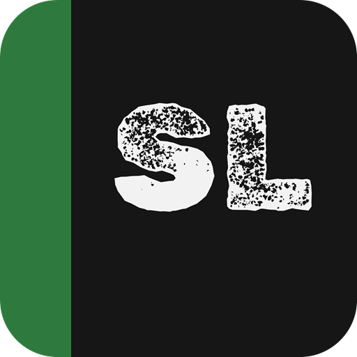
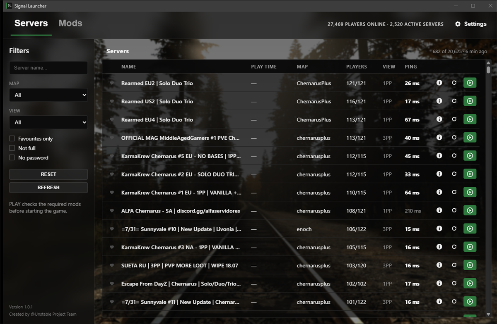
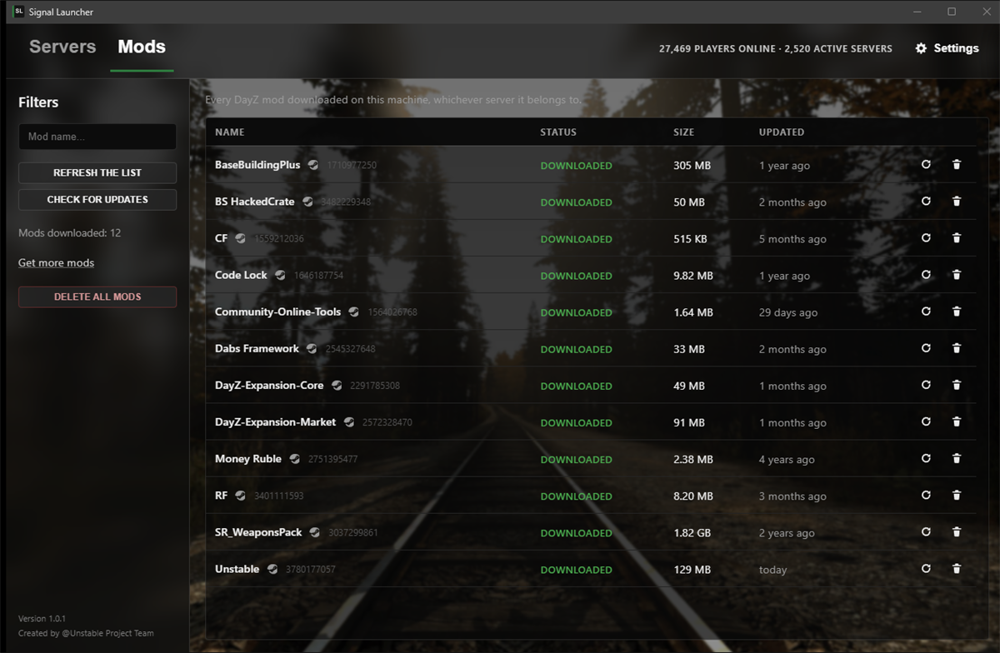
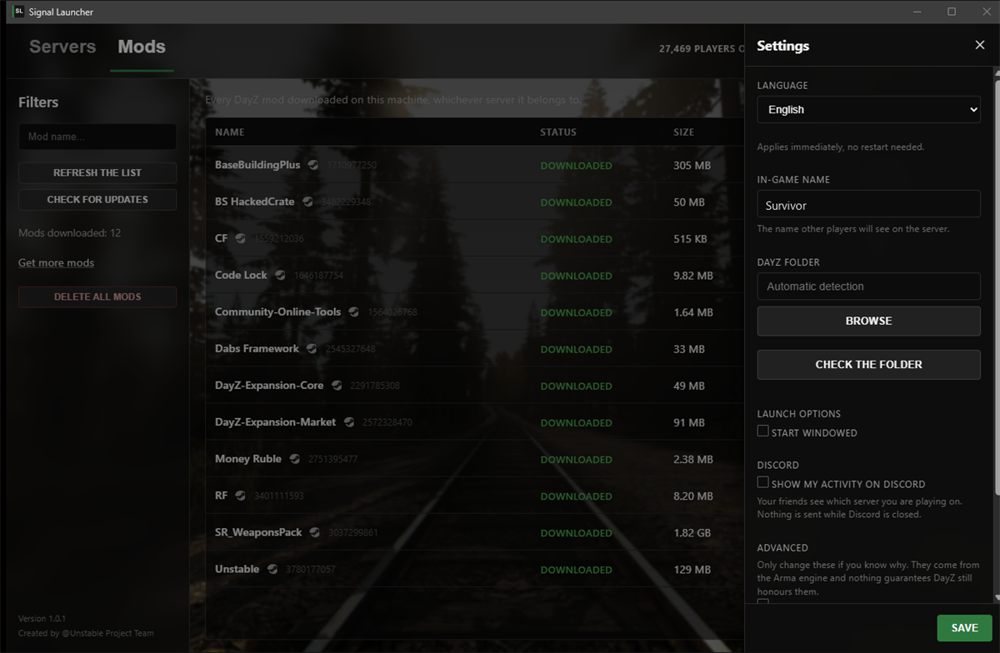

<div align="center">



# Signal Launcher

**The DayZ launcher that installs the mods for you.**

Browse community servers, click PLAY, and let it handle the rest.

<br>

[](https://github.com/dxntehh/signal-launcher-releases/releases/latest/download/Signal-Launcher-Setup.exe)


</div>

<br>



<br>

## What it does

**Mods, without thinking about them.** Click PLAY: the launcher checks what the
server requires, asks Steam to download what is missing, prepares everything,
then starts the game. You never open the Workshop.

**Every community server**, with ping, map, player count and the allowed view.
Filters, search, favourites.

**Your playtime per server**, counted while you play.

**Your activity on Discord** — your friends see which server you are on. One
checkbox in the settings turns it off.

**English, French and Russian.** Switching language applies immediately, with no
restart.

**It updates itself.** Once installed, you never come back here.

<br>

<table>
<tr>
<td width="50%"></td>
<td width="50%"></td>
</tr>
<tr>
<td align="center"><em>Every mod on your machine, its size and its date</em></td>
<td align="center"><em>Settings: language, in-game name, Discord</em></td>
</tr>
</table>


<br>

## Getting started

### 1. Download

**[Signal-Launcher-Setup.exe](https://github.com/dxntehh/signal-launcher-releases/releases/latest/download/Signal-Launcher-Setup.exe)** — this link always points to the newest version.

### 2. Windows will warn you

> **Windows protected your PC**

That is expected: the launcher is not code-signed yet, which is an expensive step
for a community project. Click **More info**, then **Run anyway**.

### 3. You need

- **Steam running** — it is Steam that downloads the mods and starts the game
- **DayZ** on the signed-in Steam account

<br>

## Verifying your download

Every release publishes the SHA-256 hash of its installer on the
[latest release page](https://github.com/dxntehh/signal-launcher-releases/releases/latest).
To confirm your file is that one, untouched:

```powershell
Get-FileHash "$env:USERPROFILE\Downloads\Signal-Launcher-Setup.exe" -Algorithm SHA256
```

If the hash matches the one on the page, the file was not altered on its way to
you.

<br>

## Updates

The launcher offers the new version at startup and installs it if you accept. It
only installs what is signed with the project key, and refuses everything else —
including if someone were to take over this hosting.

<br>

## Questions people ask

**Can this get me BattlEye-banned?**
No. The launcher starts the game through `DayZ_BE.exe`, the official chain, exactly
as Bohemia's own launcher does. It never reads or writes the game's memory,
injects nothing, and touches no BattlEye file. Mods stay as Steam downloaded
them, signatures included.

**Why does Steam have to be running?**
The launcher owns no DayZ licence and downloads nothing itself. Your Steam client
fetches the mods and starts the game, with your entitlements.

**Where are the mods installed?**
Nowhere new: they stay in your Steam folder. The launcher only places links in an
`!SL` folder inside DayZ. Nothing is duplicated, nothing takes up space twice.

**Is the source code public?**
No. This repository only hosts the downloads; it contains no code.

<br>

<div align="center">

**Signal Launcher** — Created by @Unstable Project Team

</div>
